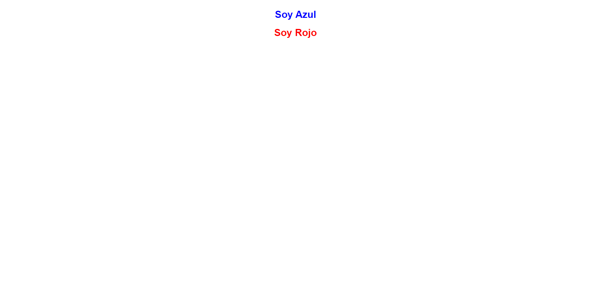

<h1>Taller 9 Julian</h1>

<h2> Información</h2>

Curso: full Stack Basico - Grupo 1

Profesor: Cristian Patiño

<h2> Link de pagina Web</h2>
<a href="https://julianmoreno026.github.io/Taller-9-full-stack/" target="_blank">Link de pagina web</a>

<h2> Punto 1: Link figma</h2>

<a href="https://www.figma.com/file/OqaIm27yH9WNP746Str35v/Julian-Camilo-Moreno-Valderrama?type=design&node-id=21%3A2&mode=design&t=XKR6LGNyeKG5GYdi-1" target="_blank">Link de Figma</a>

<h2> Punto 2: Diseño en HTML<h2>

<h2> Punto 3: Diseño en CSS<h2>

<h2> Punto 4: Titulos <h2>

<h2> Punto 5: Parrafos <h2>

<h2> Punto 6:Links <h2>

<h2> Punto 7 y 8: Navegación <h2>

<h2> Punto 9: Tabla <h2>

